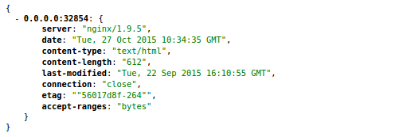

# 查看所有新启动的 Server 的 Headers

申明一个空的数组用于存放 Server 的列表

```js
var apiServers = [];
```

通过 WebSocket 连接到 Registor

```js
var ws = new WebSocket('ws://127.0.0.1:32812');
```

监听 message 事件，start 和 kill 对应 Server 的加入和退出

```js
ws.on('message', function (msg) {

  var msgObject = JSON.parse(msg);
  var payLoad = msgObject.payLoad;

  if (msgObject.status === 'start') {

    var hostIp = payLoad.NetworkSettings.Ports['80/tcp'][0].HostIp;
    var hostPort = payLoad.NetworkSettings.Ports['80/tcp'][0].HostPort;
    apiServers.push(hostIp + ":" + hostPort);

  } else if (msgObject.status === 'kill') {
    var ip = payLoad.NetworkSettings.IPAddress;
    apiServers.splice(apiServers.indexOf(ip), 1);

  }
});
```

在 Docker 主机上启动一台 Nginx 后，apiServers 数组会实时地增加一台 Server

;
